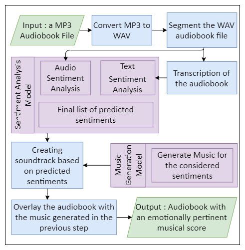
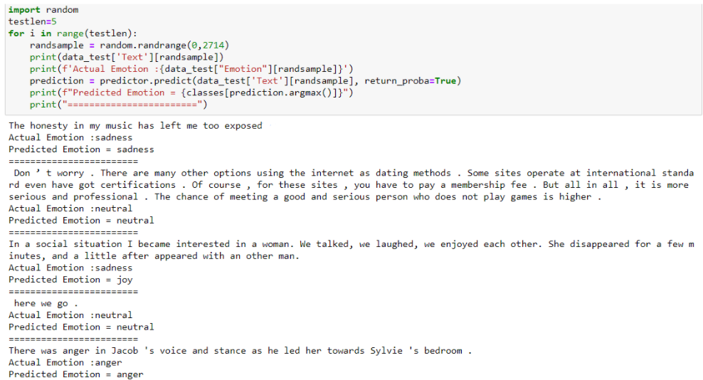
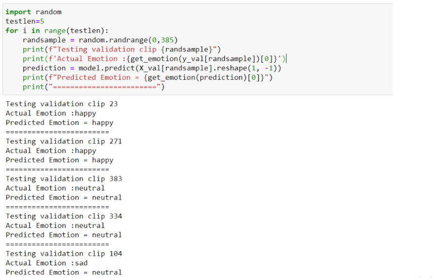

# **Deep Audiobook Tuner (DAT)**

## **About:**
Audiobooks are being used on a regular basis by hundreds of users. The system in this report aims to develop emotionally relevant music for preexisting audiobook recordings. The user will enter an audiobook MP3 file as an input to the system. This audiobook will then go through two processes, simultaneously. 
* First, the input audiobook will be run through a transcription tool to extract the text from the audiobook. This text will then be analysed using a Text-Based Sentiment Analyzer (TBSA) that is created using the BERT model.  
* Concomitantly, in the second process, the features of the audio from the audiobook that is given by the user, will be extracted. The audio features are then analysed by an Audio-Based Sentiment Analyzer (ABSA) that will predict the emotions being conveyed in the audio. This model is implemented using a DNN (Sequential model with 3 hidden layers).

Now the system will have obtained 2 values (sentiments) predicted by both, the TBSA as well as the ABSA. The values may vary and lead to an error. To avoid this, the weighted average of values will be calculated in order to generate a final list of predicted sentiments. 

As for the music generation model, we treat music as a language and using Transformer XL we generate unique musical scores for every sentiment considered by the system.

Utilizing the list of predicted sentiments as well as the music generated by the music generation model our application generates a seamless, distinctive musical score for every segment. These scores are stitched together along with the input audio file to provide the user an audiobook with felicitous background tunes.


<p align="center">
    
</p>

## **Folder Structure**
```
DeepAudiobookTunerApp
└── assets
    ├── models
    │   ├── audio_sentiment_model
    │   ├── music_model
    │   └── text_sentiment_model
    ├── music_samples
    └── pickles
└── deepaudiobooktuner
    ├── music_generation
    │   └── music_transformer
    ├── sentiment_analysis
    └── utils
└── static
    ├── css
    ├── demos
    ├── img
    │   └── icons
    └── js
    └── temp
    └── vendor
        ├── aos
        ├── bootstrap-icons
        ├── bootstrap
        ├── boxicons
        ├── glightbox
        ├── isotope-layout
        ├── purecounter
        └── swiper
└── templates
└── uploads 
```

## **Installation**
Install the necessary requirements listed in [requirements.txt](https://github.com/jendcruz22/DeepAudiobookTunerApp/blob/master/requirements.txt) file using the following command :
```
pip install -r requirements.txt
```

## **How to run the application?**
Clone the repository, open your command prompt/terminal and run the [app.py](https://github.com/jendcruz22/DeepAudiobookTunerApp/blob/master/app.py) file using the following command :
```
python app.py
```
or
```
flask run
```

## **How it works?**

* This application uses Flask, HTML, CSS, JavaScript, JQuery, and Ajax. 

* The [app.py](https://github.com/jendcruz22/DeepAudiobookTunerApp/blob/master/app.py) file consists of the flask application. 

* This flask application uses various templates that are created using HTML and are stored in the [templates](https://github.com/jendcruz22/DeepAudiobookTunerApp/tree/master/templates) folder.

* The [CSS](https://github.com/jendcruz22/DeepAudiobookTunerApp/tree/master/static/css) and [JavaScript](https://github.com/jendcruz22/DeepAudiobookTunerApp/tree/master/static/js) files used by the HTML templates are stored in the [static](https://github.com/jendcruz22/DeepAudiobookTunerApp/tree/master/static) folder. This folder also consists of the images and [icons](https://github.com/jendcruz22/DeepAudiobookTunerApp/tree/master/static/img) that the application uses.

* The main page ie the [index.html](https://github.com/jendcruz22/DeepAudiobookTunerApp/blob/master/templates/index.html) file consists of the basic details of this application: How it works, about the system, about the team, etc.

* This application accepts mp3 audio files as input ([upload_file.html](https://github.com/jendcruz22/DeepAudiobookTunerApp/blob/master/templates/upload_file.html)) which is saved in the [uploads folder](https://github.com/jendcruz22/DeepAudiobookTunerApp/tree/master/uploads). 
* While the system is processing the audio, the [preloader.html](https://github.com/jendcruz22/DeepAudiobookTunerApp/blob/master/templates/preloader.html) page runs. 
* This audio file is then processed and the music generated for every emotion considered by the system is made available for the user to listen to ([player.html](https://github.com/jendcruz22/DeepAudiobookTunerApp/blob/master/templates/player.html)). 
* If the user is satisfied with the processed audio they get can hit the proceed button and move on to the [final product page](https://github.com/jendcruz22/DeepAudiobookTunerApp/blob/master/templates/final_product.html). 
* Else, they can hit the retry button under any of the emotion's audio (the system will regenerate music for that particular emotion only) until they are happy with what's generated. Following this, they can hit the 'Proceed' button at the bottom of the [player](https://github.com/jendcruz22/DeepAudiobookTunerApp/blob/master/templates/player.html) page.
* The music generated by the system is saved temporarily in the [temp folder](https://github.com/jendcruz22/DeepAudiobookTunerApp/tree/master/static/temp)
* The [assets](https://github.com/jendcruz22/DeepAudiobookTunerApp/tree/master/assets) and [deepaudiobooktuner](https://github.com/jendcruz22/DeepAudiobookTunerApp/tree/master/deepaudiobooktuner) folders consist of the models used, the dependencies and other code that is used to run the application. 
* The working of these models and other files related to it have been elaborated on in the following repository : [deep-audiobook-tuner](https://github.com/danlobo1999/deep-audiobook-tuner)

## **Validation**
### Text-Based Sentiment Analysis Validation:
<p align="center">
    
</p>

### Audio-Based Sentiment Analysis Validation:
<p align="center">
    
</p>

## **Analysis**
### Text-Based Sentiment Analysis Accuracy Metrics:
<p align="center">
    
</p>

### Audio-Based Sentiment Analysis Accuracy Metrics:
<p align="center">
    
</p>

---


## **Collaborators:**


*   [Daniel Lobo](https://github.com/danlobo1999)
*   [Jenny Dcruz](https://github.com/jendcruz22)
*   [Smita Deulkar](https://github.com/smita3199)
*   [Leander Fernandes](https://github.com/fernandeslder)


