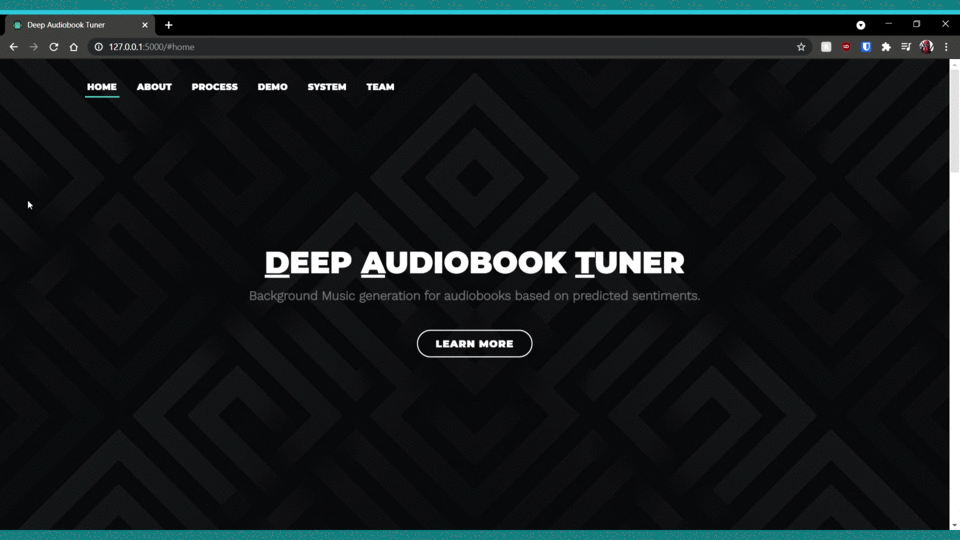

# **Deep Audiobook Tuner (DAT)**
A system that generates an apt, emotionally pertinent, unique background music for an audiobook automatically based on the current narrative for the purpose of ameliorating user-experience while being accurate, cost-efficient, and time saving.

The working of the models used by this system and other files related to it have been elaborated on in the following repository :

[deep-audiobook-tuner](https://github.com/danlobo1999/deep-audiobook-tuner)

This project was made in collaboration with:

- [Daniel Lobo](https://github.com/danlobo1999)
- [Jenny Dcruz](https://github.com/jendcruz22)
- [Smita Deulkar](https://github.com/smita3199)
- [Leander Fernandes](https://github.com/fernandeslder)

## **Table of Contents:**
1. <a href="#About">About</a>
2. <a href="#FS">Folder Structure</a>
3. <a href="#Inst">Installation & Setup</a>
4. <a href="#AppRun">How to run the application?</a>
5. <a href="#WW">What's what?</a>
6. <a href="#Demo">Demonstration</a>
7. <a href="#References">References</a>

---

## <a name="About">**1. About**</a>
Audiobooks are being used on a regular basis by hundreds of users. However most audiobooks do have background music or in some cases very generic soundtracks. This system aims to develop unique and emotionally relevant soundtracks for audiobook recordings. 

To extract the sentiments from the audiobook, we use a hybrid sentiment analysis approach consisting of text as well as audio sentiment analysis. The text sentiment model is a product of transfer learning on [Google's BERT language model](https://github.com/google-research/bert). Both the text as well as the audio model have been trained on four emotions: Anger, Happiness, Neutral and Sadness.

In order to perform text sentiment analysis, we require the transcripts of the audiobook. We are using IBM's [Watson Speech to Text](https://www.ibm.com/in-en/cloud/watson-speech-to-text) to transcribe the audiobooks.

The audio sentiment model is a fully connected Dense Neural Network with four hidden layers. It takes in audio features as its input which are extracted from the audiobooks using [Librosa.](https://github.com/librosa/librosa)

For music generation, we've implemented [bearpelican's](https://github.com/bearpelican/) approach. They created a music generation model using transformers and built using the [fastai library](https://github.com/fastai/fastai). We are using their MusicTransformer model  which uses [Transformer-XL](https://github.com/kimiyoung/transformer-xl) to take a sequence of music notes and predict the next note. A huge Thank you! to bearpelican and do check out their [project]([musicautobot](https://github.com/bearpelican/musicautobot)). 

<p align="center">
    
</p>

## <a name="FS">**2. Folder Structure</a>**
```
DeepAudiobookTunerApp
└── assets
│    ├── models
│    │   ├── audio_sentiment_model
│    │   ├── music_model
│    │   └── text_sentiment_model
│    ├── music_samples
│    └── pickles
└── deepaudiobooktuner
│    ├── music_generation
│    │   └── music_transformer
│    ├── sentiment_analysis
│    └── utils
└── static
│    ├── css
│    ├── demos
│    ├── img
│    └── js
│    └── temp
│    └── vendor
└── templates
└── uploads 
```

## <a name="Inst">**3. Installation & Setup**</a>
Clone the repository. 

Install the requirements for [Tensorflow](https://www.tensorflow.org/install) before you run the following commands.

Next, create a python or conda environment. This is an important step as the tensorflow version being used by this system (2.4.1) works only on Python 3.7 and not any of the later versions.

### **3.1 Creating a Python environment:**

Open your terminal and install the virtual environment tool with pip as follows :
```
pip install virtualenv
```
After the virtualenv has been installed, cd to the folder where you've saved this application from the terminal and run the following command to create a virtual environment :

```
cd path_to_folder
virtualenv -p python3.7.10 env_name
```

Activate your environment : 
```
env_name\Scripts\activate
```

### **3.2 Creating a conda environment :**

Open your Anaconda prompt (You can also use miniconda). Create a conda environment using the following command :
```
conda create -n env_name python=3.7.10 anaconda
```

After successfully creating your environment, activate it by running :
```
conda activate env_name
```

Once you have created an environment using either one of the above methods, install the application's requirements :
```
pip install -r requirements.txt
```

**Additional requirements:**

- Ffmpeg is available [here.](https://www.ffmpeg.org/download.html)


#### Transcription API key

The transcription process is done using a cloud service, specifically IBM's Watson Speech To Text. In order to use this service an API key is required. Create a free account and obtain your API key and URL. These values are to be saved in a file called .env as shown here `api_key = 'your_api_key' url = 'your_url'` . Keep this file in the root directory.


#### Music generation model

The music generation model trained by [bearpelican](https://github.com/bearpelican/musicautobot) is available at [here.](https://ashaw-midi-web-server.s3-us-west-2.amazonaws.com/pretrained/MusicTransformerKeyC.pth) This model is to be placed in **DeepAudiobookTunerApp/assets/models/music_model/** (Refer the <a href="#FS">folder structure</a>)


#### Text sentiment analysis model

A pre-trained text sentiment analysis model is available [here.](https://drive.google.com/drive/folders/1rE-08BOk2R7O0oLoYnBusvFuJVVwUr1J?usp=sharing) This model is to be placed in **DeepAudiobookTunerApp/assets/models/text_sentiment_model/neubias_bert_model/** (Refer the <a href="#FS">folder structure</a>)

## <a name="AppRun">**4. How to run the application?**</a>
Open your terminal, activate your python/conda environment and run the [app.py](https://github.com/jendcruz22/DeepAudiobookTunerApp/blob/master/app.py) file using the following command :
```
python app.py
```
or
```
flask run
```

## <a name="WW">**5. What's what?**</a>

* This application uses Flask, HTML, CSS, JavaScript, JQuery, and Ajax. 

* The [app.py](https://github.com/jendcruz22/DeepAudiobookTunerApp/blob/master/app.py) file consists of the flask application. 

* This flask application uses various templates that are created using HTML and are stored in the [templates](https://github.com/jendcruz22/DeepAudiobookTunerApp/tree/master/templates) folder.

* The [CSS](https://github.com/jendcruz22/DeepAudiobookTunerApp/tree/master/static/css) and [JavaScript](https://github.com/jendcruz22/DeepAudiobookTunerApp/tree/master/static/js) files used by the HTML templates are stored in the [static](https://github.com/jendcruz22/DeepAudiobookTunerApp/tree/master/static) folder. 

* The main page ie the [index.html](https://github.com/jendcruz22/DeepAudiobookTunerApp/blob/master/templates/index.html) file consists of the basic details of this application: How it works, about the system, about the team, etc.

* This application accepts mp3 audio files as input ([upload_file.html](https://github.com/jendcruz22/DeepAudiobookTunerApp/blob/master/templates/upload_file.html)) which is saved in the [uploads folder](https://github.com/jendcruz22/DeepAudiobookTunerApp/tree/master/uploads). 
* Every time the user uploads a new audiobook using the uploads page, the [clean_folder.py](https://github.com/jendcruz22/DeepAudiobookTunerApp/blob/master/clean_folder.py) file gets executed and the pre-existing files in the [uploads folder](https://github.com/jendcruz22/DeepAudiobookTunerApp/tree/master/uploads) get cleared. After doing this the system saves the audiobook file provided by the user and this file gets processed further.
* While the system is processing the audio, the [preloader.html](https://github.com/jendcruz22/DeepAudiobookTunerApp/blob/master/templates/preloader.html) page runs. 
* This audio file is then processed and the music generated for each emotion taken into account by the system is made available for the user to listen to ([player.html](https://github.com/jendcruz22/DeepAudiobookTunerApp/blob/master/templates/player.html)). 
* If the user is satisfied with the processed audio they get can hit the proceed button and move on to the [final product page](https://github.com/jendcruz22/DeepAudiobookTunerApp/blob/master/templates/final_product.html). 
* Else, they can hit the retry button under any of the emotion's audio (the system will regenerate music for that particular emotion only) until they are happy with what's generated. Following this, they can hit the 'Proceed' button at the bottom of the [player](https://github.com/jendcruz22/DeepAudiobookTunerApp/blob/master/templates/player.html) page.
* The music generated by the system is saved temporarily in the [temp folder](https://github.com/jendcruz22/DeepAudiobookTunerApp/tree/master/static/temp)
* The [assets](https://github.com/jendcruz22/DeepAudiobookTunerApp/tree/master/assets) and [deepaudiobooktuner](https://github.com/jendcruz22/DeepAudiobookTunerApp/tree/master/deepaudiobooktuner) folders consist of the models used, the dependencies and other code that is used to run the application. 
* The working of these models and other files related to it have been elaborated on in the following repository : [deep-audiobook-tuner](https://github.com/danlobo1999/deep-audiobook-tuner)

## <a name="Demo">**6. Demonstration**</a>
Some examples of our system are available in the [demos directory](https://github.com/jendcruz22/DeepAudiobookTunerApp/tree/master/static/demos).

Click on the GIF to watch the demonstration video.
[](https://www.youtube.com/watch?v=u8u-r0S84YU)

---


## <a name="References">**7. References:**</a>

[1[ [Google's BERT model](https://github.com/google-research/bert)

[2] [Ktrain wrapper for Keras](https://github.com/amaiya/ktrain/tree/23baf7cd75bdf44cb096438e7dd4c7b74734e472)

[3] [Speech-Emotion-Analyzer](https://github.com/MITESHPUTHRANNEU/Speech-Emotion-Analyzer)

[4] [Musicautobot](https://github.com/bearpelican/musicautobot)

